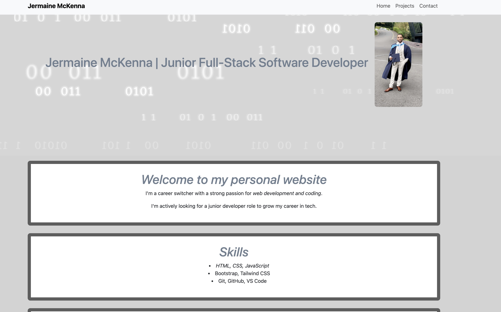
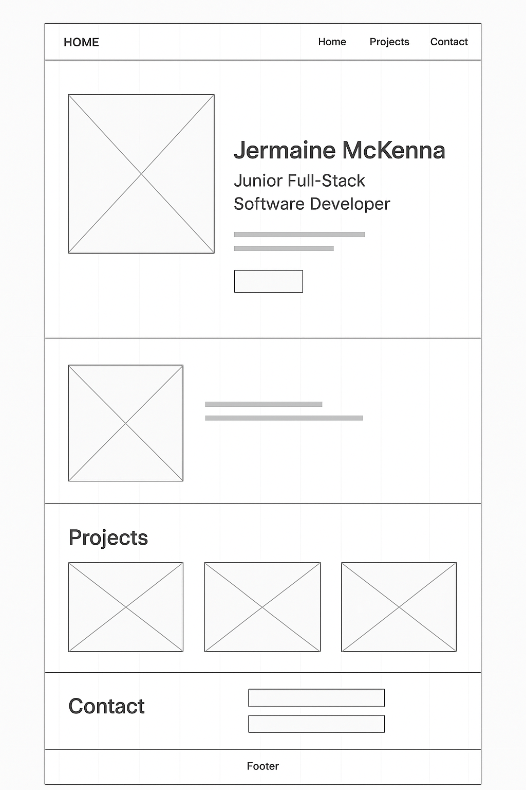

## 🌐 Project 1: Personal Website

## 👨🏾‍💻 Jermaine Mckenna | Junior Web Developer

### 📝 Projects Goal - 

The purpose of this website is to draw attention of hirers and recruiters in the hope of getting hired, my personal cv and previous projects will be highlighted on the website.

## 🧠 Primary Audience - 

The type of audience i'm hoping to get for the website is Tech & Software recruiters.

## 📒 User Stories - 

- As a hiring manager, I want to quickly understand who Jermaine is and what he can do, so I can assess his suitability for a junior web development role.

- As a recruiter, I want to see examples of Jermaine’s previous projects, so I can evaluate his coding skills and creativity.

- As a potential employer, I want to view Jermaine’s resume/CV, so I can get a detailed overview of his education and experience.

- As a tech lead, I want to view Jermaine’s GitHub profile, so I can see the quality and structure of his code and his collaboration habits.

- As someone hiring for a junior developer, I want to contact Jermaine easily, so I can invite him to an interview.

- As a visitor on mobile, I want to navigate the website smoothly, so I can view content without layout issues.

- As a developer reviewing Jermaine’s portfolio, I want to understand what technologies he knows, so I can compare his skills with our team’s stack.

- As a curious visitor, I want to know what kind of developer Jermaine is and what drives him, so I can get a sense of his personality and goals.

## :gear: Built Using - 

- HTML 5 (Page structure)
- CSS3 (Styling and responsiveness)
- Bootstrap 5 (Responsie layout)
- Visual Studio Code (Code editor for development)
- Figma (Wireframe)

## :star: Features - 
- Fully Responsive to all devices (desktop, tablet and mobiles)
- Navigation Bars to direct to other pages within the website (project and contact pages)
- nteractive buttons and links to other sites from within the page (projects)
- Clean, Simple layout
- Downloadable CV
- Media/other links to contact me

## 📸 Preview of homepage screenshot - 
 
 

## 🙋🏾‍♂️ Link to Site - 
[live site](https://jermainemckenna.github.io/project1-fixed/)

## 📌 Usage - 

1. Click on the live site link, should take you to the homepage of the site.
2. Once on the homepage browse around to find out more about me and my work.
3. Open up the projects section of the page to view my previous work.
4. To get in contact with myself, open up the contact section and choose a preffered method.

## 🖥️ Installation - 

Run this project locally copy repository:

https://github.com/jermainemckenna/project1-fixed

## 🖼️ Wireframe - 

## 📊 Performance - 

## 🐜 Debbugging - 

After running my html & css codes through validators I picked out various faults and errors that had to be altered to give the site the best performance, the main faults which the validators picked up was a error to one of the header photos and heading codes which were excesively used, since these errors were identified the appropriate changes have been made.

## 📁 Future Improvements - 

- add a contact form with personalised message.
- add blog section to give more detailed account of previous projects and learning
- intergrate a backend e.g Node.js to potentially assist in adding a contact form.
- to make the site full-stack with a performance of 100 on all devices

 

